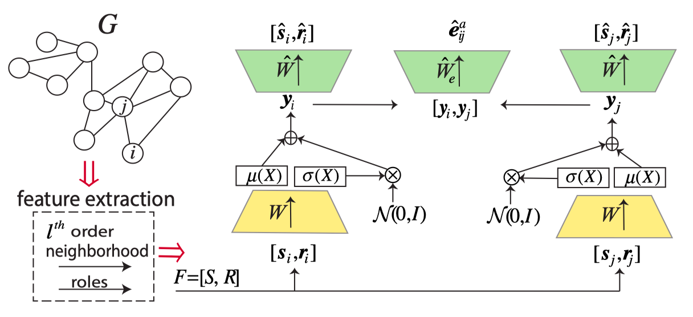

# TensorFlow Implementation of ELAINE

The basic idea of ELAINE is to capture multi label features by feeding combination of two nodes' latent vector
into a decoder and try to reconstruct label features linking the two nodes. The author also used variational
autoencoder instead of normal FC autoencoder.

Data used to construct graph is from DiDi. [Get it here](https://outreach.didichuxing.com/app-vue/dataList)

Paper: _Goyal P, Hosseinmardi H, Ferrara E, et al. Capturing Edge Attributes via Network Embedding[J]._ arXiv preprint arXiv:1805.03280, 2018. [PDF](https://arxiv.org/abs/1805.03280)

Core network structure:

> Because I am not really sure about the exact training method used by the author of the paper, this implementation propably can't represent the real ELAINE performance.
